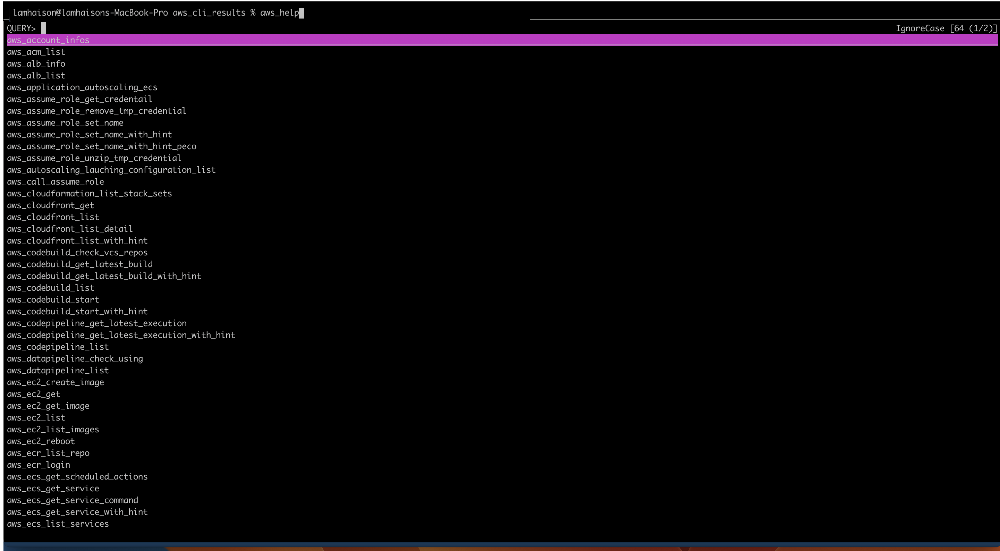

# aws-cli-utils
This is the project to collect helpful aws cli commandline with complex options to support your working
## Why I want to write this project.
- Sometimes, aws cli is list, get, describes. It is pretty hard to remember.
- Sometimes, you want to add more options on purpose and you want to have a place to collect and reuse it in the future. That is the reason I defined that structure to help me collect helpful commandlines and share on the github.


## Setup dependencies
Notes: This document is for macos environment.

### Setup aws-cli
How to install aws cli - https://docs.aws.amazon.com/cli/latest/userguide/getting-started-install.html
```
aws --version
aws-cli/2.8.1 Python/3.9.11 Darwin/22.1.0 exe/x86_64 prompt/off
```

### Install jq
```
brew install jq
jq --version
jq-1.6
```

### Install peco
To allow searching by console.


```
brew install peco
peco --version
peco version v0.5.10 (built with go1.19.2)
```

### Install assume-role
To allow assume role to a target account
```
brew install remind101/formulae/assume-role
```

### Setup your password for compress the plantext your temporary credentail.
```
# This password is used to encrypt your tmp credential.
echo "random_string" > ~/.password_assume_role_encrypted
```


## Settings when open terminal (I am using iterm)
```
mkdir -p /opt/lamhaison-tools && cd /opt/lamhaison-tools
git clone https://github.com/lamhaison/helpful-commandlines.git
echo "source /opt/lamhaison-tools/aws-cli-utils/main.sh" >> ~/.bashrc
```

## Setting on ~/.aws/config

```

[profile PROFILE_NAME-dev]
region = region
role_arn = arn:aws:iam::ACCOUNT_NAME:role/PROFILE_NAME-dev
source_profile = SOURCE_PROFILE
mfa_serial = arn:aws:iam::ACCOUNT_NAME_MFA:mfa/ACCOUNT_NAME

[profile PROFILE_NAME-stg]
region = region
role_arn = arn:aws:iam::ACCOUNT_NAME:role/PROFILE_NAME-stg
source_profile = SOURCE_PROFILE
mfa_serial = arn:aws:iam::ACCOUNT_NAME_MFA:mfa/ACCOUNT_NAME


[profile PROFILE_NAME-prd]
region = region
role_arn = arn:aws:iam::ACCOUNT_NAME:role/PROFILE_NAME-prod
source_profile = SOURCE_PROFILE
mfa_serial = arn:aws:iam::ACCOUNT_NAME_MFA:mfa/ACCOUNT_NAME
```


## How to use
### AssumeRole
```
Ctrl + @ and press enter and choose the assume role that you want to use.
```
### List all functions
```
aws_help
You can search list function and after that you can run which funtion_name to get the detail of bashshell code.
```
### Other
```
admin@MacBook-Pro-cua-Admin ~ % aws_assume_role_set_name PROFILE_NAME-dev
You set the assume role name PROFILE_NAME-dev
Running assume-role PROFILE_NAME-dev
MFA code: 165933
Encrypt temporary credential for assume-role PROFILE_NAME-dev at /tmp/aws_temporary_credentials/PROFILE_NAME-dev.zip
~
{
    "AccountAliases": [
        "PROFILE_NAME"
    ]
}
AccountId 1110987654321 


admin@MacBook-Pro-cua-Admin aws_cli_results % aws_ec2_list
------------------------------------------------------------------------------------------------------
|                                          DescribeInstances                                         |
+---------------------+---------------------------------+---------------+----------------+-----------+
|     InstanceId      |              Name               |   PrivateIp   |   PublicIp     |   State   |
+---------------------+---------------------------------+---------------+----------------+-----------+
|  i-0512340c9dc5fb531|  demo-dev-jenkins-master        |  x.x.x.x      |  1.123.123.123 |  running  |
|  i-0712343f1a9565397|  demo-dev-mongodb-master        |  y.y.y.y      |  1.123.123.123 |  running  |
+---------------------+---------------------------------+---------------+----------------+-----------+
```

