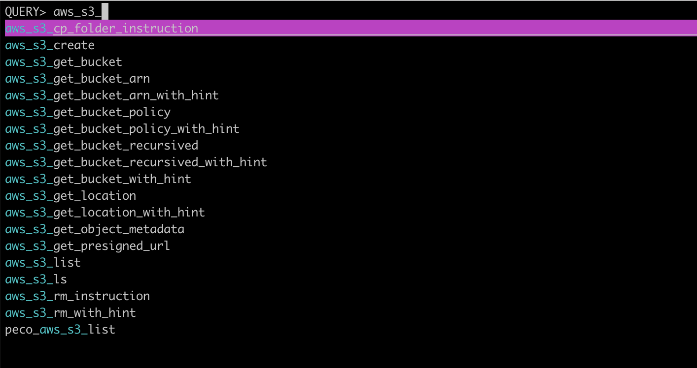
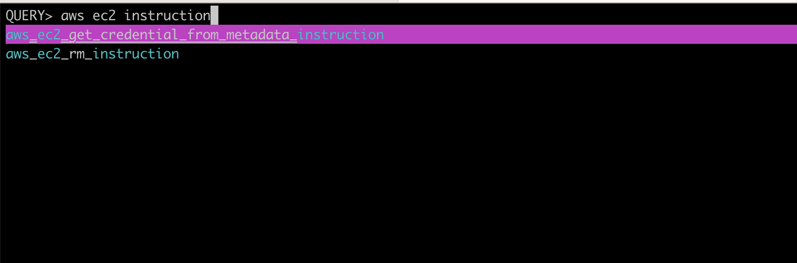
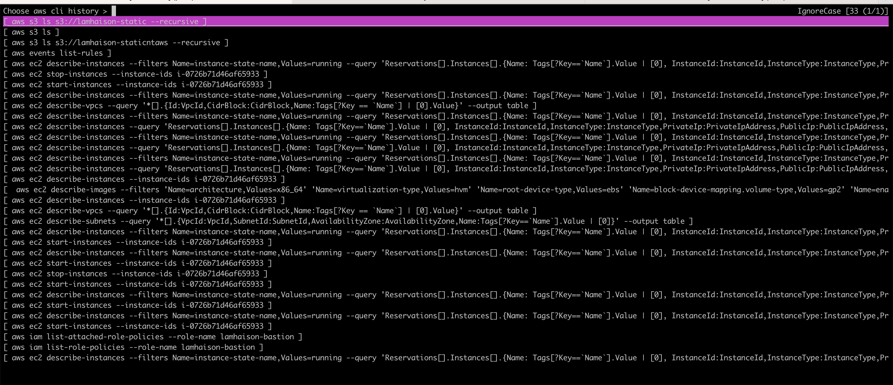
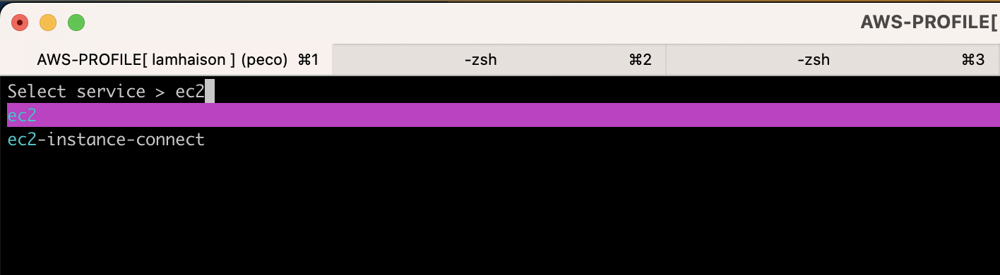
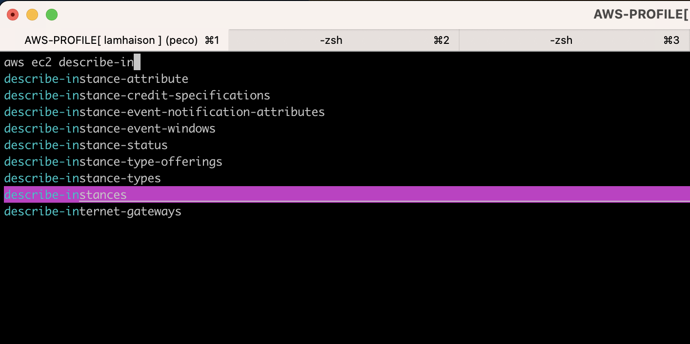
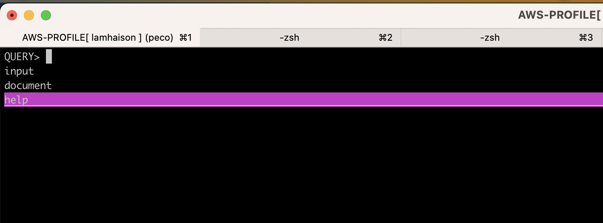
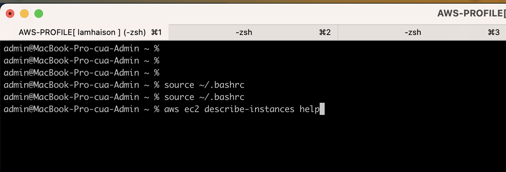

# aws-cli-utils
This is the project to collect helpful aws cli commandlines with complex options to support your working.
## Why I want to write this project.
- Sometimes, aws cli is list, get, describes. It is pretty hard to remember.
- Sometimes, you want to add more options on purpose and you want to have a place to collect and reuse it in the future. That is the reason I defined that structure to help me collect helpful commandlines and share on the github.
- You have a lot of assume role profile, you can search it by peco and assume it one time by caching feature instead of filling in MFA every time. You can re-use assume-role in the other tab of Iterm.

# Setup manually
## Setup dependencies
Notes: This document is for macos environment.

### Setup aws-cli
How to install aws cli - https://docs.aws.amazon.com/cli/latest/userguide/getting-started-install.html
```
aws --version
aws-cli/2.8.1 Python/3.9.11 Darwin/22.1.0 exe/x86_64 prompt/off
```

### Install jq
```
brew install jq
jq --version
jq-1.6
```

### Install peco
To allow searching by console.


```
brew install peco
peco --version
peco version v0.5.10 (built with go1.19.2)
```

### Install assume-role
To allow assume role to a target account
```


brew install remind101/formulae/assume-role # For Macos Intel Chip
brew tap lamhaison/formulae && brew install lamhaison/formulae/assume-role-linux # For Linux
brew tap lamhaison/formulae && brew install lamhaison/formulae/assume-role-macos-apple-chip # For Macos Apple Chip

```

### Setup your password for compress the plantext your temporary credentail.
```
# This password is used to encrypt your tmp credential.
echo "random_string" > ~/.password_assume_role_encrypted
```


## Setup the aws-cli-utils

###  Setup from source code
```
sudo mkdir -p /opt/lamhaison-tools
sudo chown $(whoami) /opt/lamhaison-tools
cd /opt/lamhaison-tools

# If you using ~/.bashrc
# Install helpful-commandlines
git clone https://github.com/lamhaison/helpful-commandlines.git
echo "source /opt/lamhaison-tools/helpful-commandlines/main.sh" >> ~/.bashrc

# Install aws-cli-utils commandlines
git clone https://github.com/lamhaison/aws-cli-utils.git
echo "source /opt/lamhaison-tools/aws-cli-utils/main.sh" >> ~/.bashrc


# If using zsh
# Install helpful-commandlines
git clone https://github.com/lamhaison/helpful-commandlines.git
echo "source /opt/lamhaison-tools/helpful-commandlines/main.sh" >> ~/.zshrc

# Install aws-cli-utils commandlines
git clone https://github.com/lamhaison/aws-cli-utils.git
echo "source /opt/lamhaison-tools/aws-cli-utils/main.sh" >> ~/.zshrc

```

### Setup from homebrew
#### Install
```
brew tap lamhaison/formulae
brew install lamhaison/formulae/aws-cli-utils
```
## Load when start an Iterm terminal
Add these lines to ~/.bashrc or ~/.zshrc or ~/.bash_profile
```
source "$(which lhs-helpful-commandlines.sh)" "/opt/homebrew/Cellar/lhs-helpful-commandlines/$(brew info lhs-helpful-commandlines | grep -E '==> .*: stable (.*)$' | sed -E 's|==> .*: stable (.*)$|\1|g')" "True" "True"

```

### Re-install the latest version
```
brew uninstall aws-cli-utils
brew untap lamhaison/formulae
brew tap lamhaison/formulae
brew install lamhaison/formulae/aws-cli-utils
```

## Setting AWS credentials

### The file ~/.aws/credentials

```
# In case, just use AWS credential permanently. Please add it on the file ./aws/config.
[lamhaison]
aws_access_key_id=xxxxxx
aws_secret_access_key=yyyyxxxxyyyy


[SOURCE_PROFILE]
region = region
aws_access_key_id=xxxxxx
aws_secret_access_key=yyyyxxxxyyyy

```

### The file ~/.aws/config
```

[profile PROFILE_NAME-dev]
region = region
role_arn = arn:aws:iam::ACCOUNT_NAME:role/PROFILE_NAME-dev
source_profile = SOURCE_PROFILE
mfa_serial = arn:aws:iam::ACCOUNT_NAME_MFA:mfa/ACCOUNT_NAME

[profile PROFILE_NAME-stg]
region = region
role_arn = arn:aws:iam::ACCOUNT_NAME:role/PROFILE_NAME-stg
source_profile = SOURCE_PROFILE
mfa_serial = arn:aws:iam::ACCOUNT_NAME_MFA:mfa/ACCOUNT_NAME


[profile PROFILE_NAME-prd]
region = region
role_arn = arn:aws:iam::ACCOUNT_NAME:role/PROFILE_NAME-prod
source_profile = SOURCE_PROFILE
mfa_serial = arn:aws:iam::ACCOUNT_NAME_MFA:mfa/ACCOUNT_NAME

# Add this for searching on the menu by Peco when using the tool.
[lamhaison]
region = region

```

## How to use
### AssumeRole
```
Hotkey (US keyboard layout) : Ctrl + @ (number 2)  and press enter and choose the assume role that you want to use.
Typing function_name: aws_assume_role_set_name_with_hint
```
### List all functions
```
Hotkey (US keyboard layout): Ctrl + h and you can search the funtion and enter to chose which commandline you want to run or edit before running.
Typing function_name: aws_help (You only search the name function, can not select or edit funtion directly on console).
```
You can search list function and after that you can run which `funtion_name` to get the detail of bashshell code.

* You can search by a keyword


* You can search by multi keywords with space seperately. Thank for Peco feature. It is pretty helplful.



### List history and select the commandline that you want to re-run
```
Hotkey (US keyboard layout): Ctrl + r and you can search the history commandlines and enter to chose which commandline you want to run or edit before running.
```


### List history of aws cli
```
Hotkey (US keyboard layout): Option + h or aws_history
```



### When you want to build a aws commandline to build your aws cli with hint by Peco search
```
Hotkey (US keyboard layout): Option + ac
```






### Other
```
source ~/.bashrc
aws_assume_role_set_name PROFILE_NAME-dev
You set the assume role name PROFILE_NAME-dev
Running assume-role PROFILE_NAME-dev
MFA code: 165933
Encrypt temporary credential for assume-role PROFILE_NAME-dev at /tmp/aws_temporary_credentials/PROFILE_NAME-dev.zip
~
{
    "AccountAliases": [
        "PROFILE_NAME"
    ]
}
AccountId 1110987654321 


admin@MacBook-Pro-cua-Admin aws_cli_results % aws_ec2_list
------------------------------------------------------------------------------------------------------
|                                          DescribeInstances                                         |
+---------------------+---------------------------------+---------------+----------------+-----------+
|     InstanceId      |              Name               |   PrivateIp   |   PublicIp     |   State   |
+---------------------+---------------------------------+---------------+----------------+-----------+
|  i-0512340c9dc5fb123|  demo-dev-jenkins-master        |  x.x.x.x      |  1.123.123.123 |  running  |
|  i-0712343f1a9565456|  demo-dev-mongodb-master        |  y.y.y.y      |  1.123.123.123 |  running  |
+---------------------+---------------------------------+---------------+----------------+-----------+
```


## CONTRIBUTING

Contributions are very welcomed!

Start by reviewing [contribution guide](CONTRIBUTING.md) and our [code of conduct](CODE_OF_CONDUCT.md). After that, start coding and ship your changes by creating a new PR.

## LICENSE

Apache 2 Licensed. See [LICENSE](LICENSE) for full details.

## AUTHORS

<!--- Replace repository name -->
<a href="https://github.com/lamhaison/aws-cli-utils/graphs/contributors">
  
</a>
